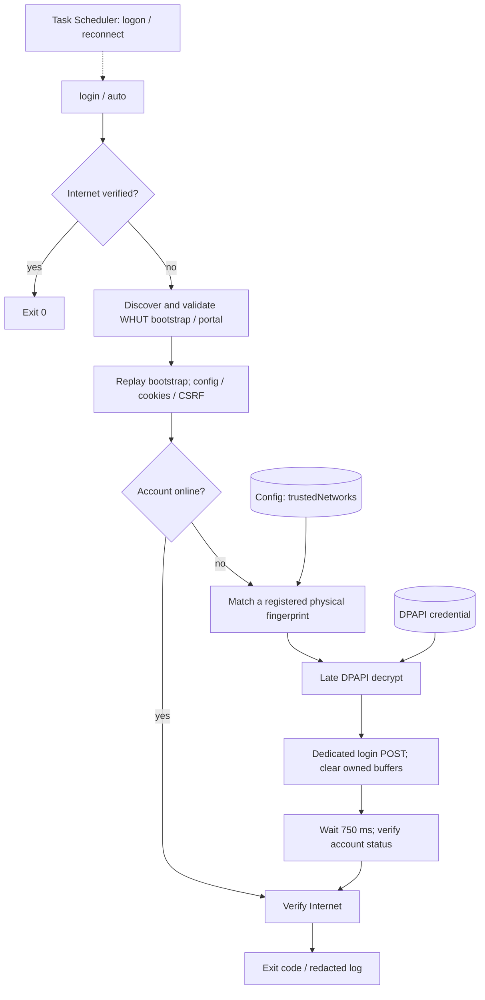

# WUTNet

**v1.3.2 · Field-verified Windows release**

A minimal PowerShell 7 authenticator and auto-login utility for the Wuhan University of Technology captive portal.

Windows-native · single-file · zero third-party runtime dependencies · cross-campus dynamic discovery · TUN/VPN-aware · no resident daemon

[Download v1.3.2](https://github.com/styayur/wutnet/releases/tag/v1.3.2) · [Release notes](docs/releases/v1.3.2.md) · [Field validation](docs/FIELD_VALIDATION.md)

## What it does

WUTNet discovers the current WHUT login session, authenticates when needed, and verifies both account status and Internet recovery. It protects the saved password with Windows DPAPI and can run on logon or network reconnect through Task Scheduler.

The Windows client is one file: `whut-net.ps1`. The existing [experimental Android client](docs/ANDROID.md) is maintained separately and is unchanged by this release.

## Why WUTNet exists

Repeated campus-network sign-ins should not require opening a browser every time. WUTNet performs a finite check or login, returns an exit code, and exits. It discovers campus-specific session parameters instead of storing an old portal URL.

## Requirements

- Windows 10 or 11; field-verified on Windows 11.
- PowerShell **7.2+ Core** (`pwsh.exe`); field-verified with **7.6.6**.
- An authorized WHUT account and connection to the WHUT network.

Windows PowerShell 5.1 (`powershell.exe`) is not supported. No Python, browser extension, third-party PowerShell module, service or additional runtime is required by the client.

## Quick Start

Download `whut-net.ps1` and `SHA256SUMS.txt` from the release. Compare the script hash with `Get-FileHash .\whut-net.ps1 -Algorithm SHA256`. Keep the script in a stable location before installing automation.

Open PowerShell 7 while connected to WHUT. If Windows has marked the downloaded file, inspect it and run `Unblock-File .\whut-net.ps1`.

```powershell
.\whut-net.ps1 setup -Username <student-id>
.\whut-net.ps1 diagnose
.\whut-net.ps1 login
```

Enter the password at the secure prompt. After successful login:

```powershell
.\whut-net.ps1 status
.\whut-net.ps1 install
```

To trust another WHUT physical network, such as WHUT-DORM in addition to WHUT-WLAN, connect to that network and explicitly register it:

```powershell
.\whut-net.ps1 setup -AddNetwork
```

`-AddNetwork` keeps the existing account, encrypted password and registrations. Registering the same fingerprint twice does not duplicate it. Ordinary `setup` saves a password and resets the trust list to the current network; use `-AddNetwork` to preserve previous networks.

## Commands

| Command | Purpose |
| --- | --- |
| `setup [-Username <student-id>]` | Save account/password and register the current physical network |
| `setup -AddNetwork` | Explicitly append a physical network without changing the account/password |
| `status` | Check Internet and account state; never log in |
| `login` | Authenticate once if needed, then verify account and Internet |
| `auto` | Automatic mode; exit immediately if already online; otherwise require a registered fingerprint |
| `diagnose` | Inspect discovery, bootstrap, physical fingerprint, API, CSRF and status without sending the password |
| `install` | Register the per-user scheduled task |
| `uninstall` | Remove the task and local configuration, credential and logs |
| `help` | Show usage and exit codes |

## Automatic Login

`install` creates **WHUT-Net AutoLogin**, using the current interactive user's token and least privilege. It stores no Windows account password.

```text
Windows Task Scheduler
  → user logon or NetworkProfile EventID 10000
  → pwsh -NoLogo -NoProfile -NonInteractive
  → whut-net.ps1 auto
  → verify or authenticate, then exit
```

There is no polling loop, resident service or daemon. Overlapping task instances are ignored. Reconnect-triggered login has been field-tested without opening a browser.

The executable resolver prefers `%LOCALAPPDATA%\Microsoft\WindowsApps\pwsh.exe`, then `$PSHOME\pwsh.exe`, then one unambiguous installed application candidate. The Store alias survives package-version changes. Re-run `install` after moving the script.

## How it works

Internet preflight checks NCSI content and NeverSSL identity independently. If not online, discovery tries NCSI redirect, NCSI content, NeverSSL, then the direct WHUT page. Each request has a 4-second timeout; discovery shares a 16-second request budget, with up to 8 seconds of preflight.

```text
Public HTTP probe → /api/r/<nasId> bootstrap → canonical login page
→ config.js → safe API base → CSRF + cookies → account/status
→ registered physical network check → late DPAPI decrypt → login POST
→ account/status verification → Internet recovery verification
```

`nasId`, `userip`, `acip`, `acname` and `wlanacname` are discovered per session. Bootstrap is replayed in the same cookie jar before the canonical page is opened. Foreign redirects are ignored without following them or granting trust; an unknown WHUT destination returns `ProtocolChanged` (13).

Only active `var|let|const host_url` declarations are parsed from config.js. Comments are ignored, identical values are deduplicated, and distinct values are rejected. A missing config permits `/api` fallback only after an active CSRF fingerprint check. Status and login JSON shapes are also validated.

Authentication success means **login response + account status verification + Internet recovery verification**, not merely a successful POST.

## Security Model

- **Storage:** DPAPI `CurrentUser` protects the password in `%LOCALAPPDATA%\WHUT-Net\credential.dat`. Account and fingerprints are in `config.json`; bounded logs are in `whut-net.log`. These files are ignored by Git.
- **Network registrations:** config v3 stores `trustedNetworks[]`. Existing v2 `trustedNetwork` is automatically migrated on read without changing the account or credential. Legacy v1 remains readable but needs explicit setup before automatic login.
- **Trust checks:** auto must match one registered IPv4 prefix, gateway, portal host and interface identity. Profile/SSID names never enroll networks or grant trust. DHCP host-address and profile suffix changes are tolerated. Manual login permits interface alias/type changes while retaining prefix/gateway/host checks.
- **Physical selection:** enumerate active physical adapters, exclude APIPA and `198.18.0.0/15`, and match the bootstrap `userip` exactly when supplied. Otherwise use unambiguous physical candidates/metrics. TUN route ownership alone does not select the fingerprint.
- **Destination:** exact WHUT host/path/port checks apply to bootstrap and login. API bases must be safe relative paths. HTTP proxy use and automatic redirects are disabled.
- **Password lifetime:** decrypt only immediately before the dedicated POST. Clear owned BSTR, character and byte buffers on success/failure. No plaintext password string is deliberately constructed. PowerShell/.NET cannot guarantee immediate removal of every runtime/HTTP-stack copy.
- **Output:** no password, account identifier, Cookie, CSRF value, complete user IP, request body or raw server message is logged. Protocol errors are separate from credential rejection.

WHUT currently uses **HTTP**. DPAPI protects the password **at rest only**. IP/path/protocol/network fingerprints are defence-in-depth, not cryptographic server authentication. This script does not manage VPNs or bind sockets to the selected adapter; a TUN/VPN can still block portal traffic or change routing after a trust check.

## Field Validation

**Field-verified against multiple current WHUT access environments; future portal changes may require protocol updates.** Maintainer-supplied field evidence covers Windows 11 and PowerShell 7.6.6 Core:

- ✓ `/api/r/<nasId>` bootstrap and multiple campus/BRAS environments
- ✓ Dynamic `nasId` / `userip` / `acip` / `acname`
- ✓ Physical WLAN discovery with Meta/TUN present
- ✓ Comment-safe config.js `/api` discovery and CSRF + cookies
- ✓ Real credential login, status verification and Internet recovery
- ✓ Online `status` and idempotent `auto`
- ✓ Task installation with the Store alias and scheduled auto-login after reconnect

The [engineering record](docs/FIELD_VALIDATION.md) separates these field observations from offline regression tests. Multiple-network registration and v2→v3 migration added during release preparation are offline-tested; a fresh multi-registration campus-switch test is not claimed.

## Troubleshooting

| Symptom | Check |
| --- | --- |
| Empty reply from server | Confirm WHUT connectivity and discover a fresh campus session. The portal may be unreachable or the captured URL stale. Do not reuse an old `/api/r/<nasId>?...` URL. |
| `ProtocolChanged` / exit 13 | WHUT frontend/API shape or redirect path may have changed. Run `diagnose`; do not bypass the allowlist. |
| No physical fingerprint | Check WHUT connectivity, multiple physical uplinks and complete IPv4/gateway data. TUN route ownership is excluded from selection; an unmatched campus `userip` fails closed. |
| Different campus/network refused | Connect there and explicitly run `setup -AddNetwork`. No network is trusted merely because its profile name looks familiar. |
| PowerShell not found / task install fails | Verify PowerShell 7 and its Store App Execution Alias at `%LOCALAPPDATA%\Microsoft\WindowsApps\pwsh.exe`. Multiple ambiguous fallback candidates are refused. |
| HTTP warning | Expected: DPAPI protects storage, while WHUT's portal itself uses HTTP. |
| Script execution blocked | Use PowerShell 7, inspect the downloaded script and unblock that file; no global policy change is required. |

`diagnose` showing Internet OK means no authentication is needed. Local logs can be inspected with `Get-Content "$env:LOCALAPPDATA\WHUT-Net\whut-net.log" -Tail 50`; review any diagnostic output before sharing.

| Exit | Meaning |
| ---: | --- |
| 0 | Successful command / online / verified login |
| 10 | Account offline |
| 11 | Portal not found or session `nasId` missing |
| 12 | Untrusted network/destination or unsafe API path |
| 13 | Unsupported or changed protocol |
| 20 | Authentication explicitly rejected |
| 21 | Additional verification required |
| 22 | CSRF/bootstrap request failed |
| 30 | Portal/API unavailable |
| 31 | Discovery exhausted after probe timeouts |
| 40 | Network or post-authentication verification failure |
| 50 | Local config, credential or executable-resolution error |

## Architecture / Protocol

<!-- architecture:overview:start -->

<!-- architecture:overview:end -->

All Windows authentication logic stays in one PowerShell file. The 750 ms delay is a single verification delay, not a retry loop. See [protocol details](docs/protocol.md) and [architecture evidence](docs/architecture/README.md). Existing [Android notes](docs/ANDROID.md) describe the separate client.

## Limitations

This is an unofficial community client, not affiliated with WHUT. It has no CAPTCHA solver, Wi-Fi scanner, VPN manager, GUI or cloud service. Scheduled execution uses an interactive user session. Future portal changes, ambiguous physical networks or network filtering can prevent authentication; field verification is not a promise of universal campus compatibility.

## Development

Run from PowerShell 7 on Windows; tests use synthetic credentials and mocked transport:

```powershell
pwsh -NoLogo -NoProfile -File .\tests\windows.tests.ps1
pwsh -NoLogo -NoProfile -File .\tests\check-secrets.ps1 -History
pwsh -NoLogo -NoProfile -File .\tests\check-architecture.ps1
```

Windows CI runs `Parser::ParseFile`, offline regression and the secret/local-state guard. Documentation checks are lightweight; optional Mermaid rendering remains a manual development check. Android CI and source are unchanged. The secret guard is intentionally small, not an exhaustive secret scanner.

## License

[MIT](LICENSE). See [third-party notices](THIRD_PARTY.md) and the repository owner's [license policy](https://github.com/styayur/styayur/blob/main/LICENSE_POLICY.md). Use only an account and network you are authorized to access.
