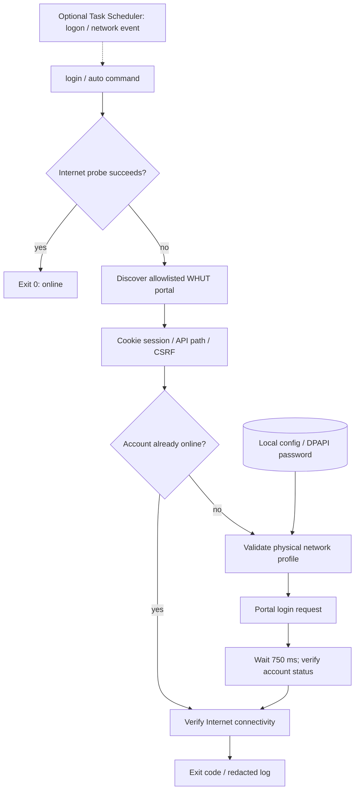

# WHUT-Net

[](https://github.com/PowerShell/PowerShell)
[](#requirements)
[](LICENSE)

A minimal, zero-third-party-runtime-dependency PowerShell 7 authenticator for the Wuhan University of Technology (WHUT) captive portal.

WHUT-Net is designed to replace repeated browser-based campus-network login with a small, auditable Windows-native script. It discovers the current WHUT portal session dynamically, handles CSRF/cookies, protects the stored password with Windows DPAPI, and can run automatically through Task Scheduler without keeping a resident process in memory.

> **Status:** `v0.1.0-alpha.1` is an early, experimental release. Local configuration, PowerShell 7 execution, credential storage and Internet probing have been exercised, but the complete offline → captive portal → authentication → Internet recovery path should still be treated as experimental until field-tested against the current WHUT deployment.

## 无凭据命令演示

```powershell
pwsh -NoProfile -File ./whut-net.ps1 help
```

2026-10-09 在 Windows 实际运行，exit 0，输出开头：

```text
WHUT-Net v0.1.0-alpha.1

Usage:
  .\whut-net.ps1 setup [-Username <student-id>]
  .\whut-net.ps1 status
  .\whut-net.ps1 login
  .\whut-net.ps1 auto
```

这是命令入口验证；未使用校园账号，未执行 setup/login/install，不代表校园网认证成功。实际认证需要受信任的校园网络，现有安装和安全说明继续适用。

## Features

- Single-file PowerShell 7 implementation
- No Python, browser extension, Docker, service or third-party PowerShell module
- Dynamic captive-portal discovery
- Dynamic `nasId` extraction
- Dynamic API base-path discovery from the WHUT portal configuration
- Cookie-aware CSRF session handling
- Windows DPAPI `CurrentUser` password protection
- Explicit proxy bypass for local portal traffic
- Hard-coded WHUT portal host/path allowlist
- Trusted physical Windows network-profile binding for automatic login
- Optional Task Scheduler integration
- No resident polling loop
- Bounded local logging with no password, cookie or CSRF-token output

## Requirements

- Windows 10 or Windows 11
- PowerShell 7.2 or later (`pwsh.exe`)
- Access to the WHUT campus network

Windows PowerShell 5.1 (`powershell.exe`) is not supported.

Check your version:

```powershell
$PSVersionTable.PSVersion
$PSVersionTable.PSEdition
```

Expected:

```text
7.2+
Core
```

## Quick Start

Clone or download `whut-net.ps1`, then open PowerShell 7 in the script directory.

If Windows has marked the downloaded script as originating from the Internet, remove that file-level mark:

```powershell
Unblock-File .\whut-net.ps1
```

Configure your account while connected to the WHUT network:

```powershell
.\whut-net.ps1 setup -Username <student-id>
```

The password prompt is interactive. The password is stored using Windows DPAPI and is not written to the repository or configuration file in plaintext.

Before attempting login, inspect the current network and portal state:

```powershell
.\whut-net.ps1 diagnose
```

Then test a manual login:

```powershell
.\whut-net.ps1 login
```

Verify the result:

```powershell
.\whut-net.ps1 status
```

Only after manual testing succeeds should automatic login be enabled:

```powershell
.\whut-net.ps1 install
```

## Commands

| Command | Purpose |
| --- | --- |
| `setup [-Username <student-id>]` | Save the username, DPAPI-protected password and current trusted physical network profile |
| `status` | Check Internet and WHUT authentication state without logging in |
| `login` | Authenticate once when required |
| `auto` | Idempotent mode intended for Task Scheduler; exits immediately when already online |
| `diagnose` | Inspect portal discovery, `nasId`, API base, CSRF acquisition and account state without submitting the stored password |
| `install` | Register the per-user automatic-login scheduled task |
| `uninstall` | Remove the scheduled task and all WHUT-Net local state |
| `help` | Show built-in usage information |

## How It Works

```text
Windows network connected
        |
        v
Internet probe
   |          |
 online     captive/offline
   |          |
  exit        v
        Discover WHUT portal
               |
               v
        Validate host + path
               |
               v
          Extract nasId
               |
               v
        Read API base path
               |
               v
       Establish CSRF/cookie
             session
               |
               v
       Check account status
               |
          offline only
               |
               v
      Validate trusted local
        network profile
               |
               v
       Decrypt DPAPI password
               |
               v
          POST login
               |
               v
       Verify account status
               |
               v
        Verify Internet access
```

The script does not keep a background daemon running. When automatic login is installed, Windows Task Scheduler invokes the script on user logon and network-connect events; the process exits after the check or authentication attempt completes.

## Security Model

WHUT-Net deliberately keeps the trust boundary narrow.

### Credentials at rest

The password is stored under:

```text
%LOCALAPPDATA%\WHUT-Net\credential.dat
```

PowerShell's `ConvertFrom-SecureString` uses Windows DPAPI for the current Windows user. Another Windows account cannot normally decrypt the stored value.

The username and trusted Windows network-profile names are stored separately in:

```text
%LOCALAPPDATA%\WHUT-Net\config.json
```

### Portal allowlist

Credentials are only submitted after the discovered captive portal matches the expected WHUT portal host and path.

Dynamic values such as `nasId` may change between sessions, but the authentication destination is not accepted from an arbitrary redirect.

### Trusted local network profile

Automatic login additionally requires a physical Windows network profile captured during `setup`.

This is a defence-in-depth check, not cryptographic server authentication.

### HTTP limitation

The current WHUT captive portal uses HTTP.

DPAPI protects the password **at rest**, but WHUT-Net cannot provide transport encryption that the upstream portal itself does not support. Users should understand this limitation before enabling unattended authentication.

### Logging

WHUT-Net does not intentionally log:

- passwords
- decrypted credential material
- cookies
- CSRF token values
- login request bodies
- usernames and trusted network-profile names
- raw portal response messages or unexpected exception details

The log is stored at:

```text
%LOCALAPPDATA%\WHUT-Net\whut-net.log
```

and is rotated when it reaches approximately 1 MiB.

## Automatic Login

After validating manual login:

```powershell
.\whut-net.ps1 install
```

This registers a per-user Task Scheduler task named:

```text
WHUT-Net AutoLogin
```

The task runs with the current interactive user's token and least privilege. It is triggered by:

- user logon
- Windows Network Profile connection events

The task invokes PowerShell 7 and executes:

```text
whut-net.ps1 auto
```

No Windows account password is stored in Task Scheduler.

To remove the task and local WHUT-Net data:

```powershell
.\whut-net.ps1 uninstall
```

## Exit Codes

| Code | Meaning |
| ---: | --- |
| `0` | Online or authentication succeeded |
| `10` | WHUT portal reached; account offline |
| `11` | WHUT portal not discovered or `nasId` missing |
| `12` | Untrusted portal, network profile or unsafe API path |
| `20` | Authentication failed |
| `21` | Additional verification/code check required |
| `22` | CSRF acquisition failed |
| `30` | WHUT portal/API unavailable |
| `40` | Network failure or post-authentication Internet verification failure |
| `50` | Local configuration or credential error |

These codes are intended to make the script usable from Task Scheduler and other PowerShell automation.

## Troubleshooting

### The script requires PowerShell 7.2

If the error mentions Windows PowerShell 5.1, you launched `powershell.exe` instead of `pwsh.exe`.

Run:

```powershell
pwsh
```

Then retry the command.

### Script execution is blocked

Inspect the current policy:

```powershell
Get-ExecutionPolicy -List
```

For a downloaded copy you have inspected, removing the file's Internet mark is usually preferable to globally weakening PowerShell policy:

```powershell
Unblock-File .\whut-net.ps1
```

### Diagnose reports `Internet: OK`

This means the machine already has Internet access, so WHUT-Net intentionally does not contact the captive portal.

To validate the complete authentication flow, test during a genuine unauthenticated WHUT session.

### Inspect logs

```powershell
Get-Content "$env:LOCALAPPDATA\WHUT-Net\whut-net.log" -Tail 50
```

## Project Scope

WHUT-Net intentionally does **not** aim to become a general campus-network manager.

The project is limited to:

- detecting the WHUT captive portal
- authenticating safely enough within the constraints of the upstream portal
- integrating cleanly with Windows
- exiting when its work is complete

Features such as GUI management, multi-account rotation, bandwidth monitoring, generic multi-campus adapters and persistent background polling are outside the current scope.

## Disclaimer

This is an unofficial community project and is not affiliated with, endorsed by, or maintained by Wuhan University of Technology.

Campus-network infrastructure and authentication APIs may change without notice. Use the script only with an account and network access you are authorised to use.

## Architecture

<!-- architecture:overview:start -->

<!-- architecture:overview:end -->

本图只描述远端主分支的 Windows PowerShell 客户端，不包含其他分支的 Android 实现。所有网络调用由 `whut-net.ps1` 发起；配置和 DPAPI 密码保存在当前用户本地目录。凭据发送前检查 Portal allowlist 和 Windows 物理网络配置。

Portal 当前使用 HTTP，DPAPI 只保护本地密码，不能提供传输加密。登录接口返回后还需核对账号状态和实际联网结果。当前源码没有自动重试循环或退避模块：失败返回明确 exit code；后续重试来自用户再次调用，或已安装任务的下一次登录/联网事件。不得把一次 750 ms 等待画成重试机制。

[Source evidence and diagram verification](docs/architecture/README.md).

## License

MIT License.

This follows the repository owner's [License Policy](https://github.com/styayur/styayur/blob/main/LICENSE_POLICY.md), which assigns MIT to small scripts and automation projects.

Third-party materials, if introduced in the future, remain under their respective upstream licences and are not relicensed by this project.
